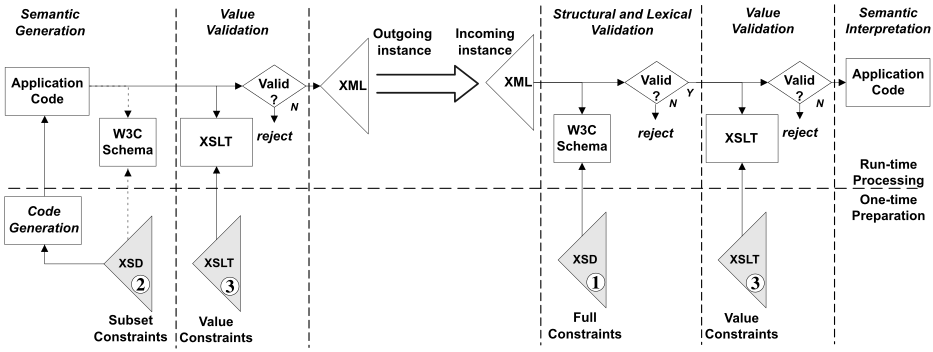

# README

The build process in this repository creates the suite of subset schema artefacts distilled from either UBL 2.1, UBL 2.2, or UBL 2.3 CSPRD02. It leverages [free developer tools made available by Crane Softwrights Ltd.](http://CraneSoftwrights.com/links/res-git.htm)

The demonstration environment provided in this repository is included courtesy of the [DBE Core Oy Finland https://DBEcoreDemo.com](https://dbecore.com) project, with my many thanks.

## Contributions

Contributions are welcome provided that they can be incorporated into the repository within the constraints of the [license and disclaimer information](https://github.com/CraneSoftwrights/ubl-subset-schema/blob/master/LICENSE.md).

## Licensing

Please see the [LICENSE](https://github.com/CraneSoftwrights/ubl-subset-schema/blob/master/LICENSE.md) file for the description of the license terms and disclaimers.

## The role of UBL subset schemas 

This diagram outlines the role of a subset of UBL schemas in the generation of XML documents, independent of the role of the full UBL schemas when ingesting XML documents:



The three sets of artefacts identified in the diagram are numbered as follows:

1. The full UBL schemas without being subset.
1. The subset UBL schemas supporting only the constructs needed for XML generation, optionally used to structurally-validate the output before it is sent to the recipient.
1. The additional value constraints expressed in XSLT and authored using technologies such as ISO/IEC 19757-3 Schematron, OASIS Context/Value Association (CVA), OASIS genericode, or other means, used both to pre-validate the value constraints before the document is sent to the recipient, and to validate the value constraints after the document is received by the recipient.

A subset schema can be useful in the synthesis of program code that is used by an application to create UBL business objects as needed for the particular subset. An example would be in the compilation of Java classes from XSD schema fragments. The subset schema may be useful as a cross-check of UBL instances being created by the application, however, if the application is trusted, the subset schema validation is optional. The recipient may very well be unaware of the subset schema, but even if it is known, it is typical for the recipient to use the full UBL schemas so as not to reject an incoming UBL instance that has more than what the subset dictates.

Note how the role of the validation XSLT is recommended for the outgoing instance as a sanity check. The recipient will be using the validation XSLT themselves so there is a level of confidence if the sender uses it as well before the document is sent.

A presentation outlining the distinctions between structural and value validation, and the distinctions between W3C Schema and ISO/IEC Schematron is found [here](https://docs.google.com/presentation/d/1KWxFI8Niimv1hoB50L9bDsuMgN_vCjzUDXbct6QG-DA/view).

## Further Description of this Repository

Fork this repository in order to create subset XSD and JSON validation artefacts (XSD and JSON) and documentation for either UBL 2.1, UBL 2.2, or UBL 2.3 CSPRD02 from a subset specification found in online UBL Google spreadsheets:
  - genericode serialization
  - XSD schemas
  - JSON schemas
  - ODS and XLS spreadsheets
  - HTML summary reports with and without indicating excluded UBL components

Engage GitHub Workflow Actions for this repository by going to the "Actions" tab in your repository and giving GitHub permission to run the repository's actions.

There are configuration environment variables to set in your invocation script:

`version=0.1`
- your package version

`UBLversion=2.2`
- the version of UBL (either "2.1", "2.2", or "2.3") that you are subsetting

`libGoogle=`[`https://docs.google.com/spreadsheets/d/1bWAhvsb83PvkdGeMvFXiVVSWKCIZXsoiCMLhgUrHFzY`](https://docs.google.com/spreadsheets/d/1bWAhvsb83PvkdGeMvFXiVVSWKCIZXsoiCMLhgUrHFzY)
- the URL of your Google spreadsheet for the common library (be sure not to include the "/edit..." at the end of the browser bar)
- see below for choices in starting points for your spreadsheet

`docGoogle=`[`https://docs.google.com/spreadsheets/d/1Q_-5hKiUkshJP-3yEI00NTmIf0r5I091nYRNWxxksPQ`](https://docs.google.com/spreadsheets/d/1Q_-5hKiUkshJP-3yEI00NTmIf0r5I091nYRNWxxksPQ)
- the URL of your Google spreadsheet for the documents (be sure not to include the "/edit..." at the end of the browser bar)
- see below for choices in starting points for your spreadsheet

`copyright="Subset copyright not asserted; Portions copyright &#169; OASIS Open"`
- a copyright statement asserted regarding the subset being created

`configDirectory=DBEcoreDemo`
- the subdirectory in which your configuration files are placed, and the suffix used for all configuration file names
- the configuration subdirectory cannot begin with "`UBL-`" as this is reserved for copies of the committee files

`title=DBEcoreDemo subset of UBL 2.2`
- the title of your project to put at the top of the HTML documentation reports

`package=DBEcoreDemo-subset-UBL-2.2`
- the package name of your project to use in file name composition

`subsetColumn=DBEcoreDemoSubset`
- the name of the column of your spreadsheets that specifies the particular subset being built
- the subset is specified by indicating the item's cardinality in the subset, or leaving the row blank to indicate no change in the cardinality
  - if the existing cardinality is "`0..1`" the new can be "`0`", "`0..1`", "`1`", or blank
  - if the existing cardinality is "`1`" the new must be "`1`" or blank and not anything else
  - if the existing cardinality is "`0..n`" the new can be "`0`", "`0..1`", "`1`", "`0..1`", "`0..n`", or blank
  - if the existing cardinality is "`1..n`" the new can be "`1`", "`1..n`", or blank
  - when you specify "`0`", the item is removed entirely from the schema
  - when you specify "`0`" for every item in a given class or ABIE, you will get an error message because you are forcing the user to create an empty element and empty elements are not allowed by the OASIS Business Document Naming and Design Rules; you must give the user an opportunity to define the content of an element, and, moreover, it is good style that when there is only one item remaining in a class subset that that element be made mandatory

`subsetDocsRegex="(^UBL-(RequestForQuotation|Quotation|Order|OrderResponse|OrderChange|OrderCancellation|ApplicationResponse)-2.2$)"`
- the regular expression against which the documents are checked to be included in the subset generation (note that the document names begin with "UBL-" and end with the UBL version number)
- only schemas for the listed names will be generated; if you don't list the name then you won't get the schema
- this is a regular expression, so you can use wild cards, for example, to get all documents use `subsetDocsRegex=".*"`

Committee spreadsheets
  - UBL 2.1 Library Copy:
    -  [`https://docs.google.com/spreadsheets/d/15KY7YsYY8pNCC64r3nt4AW433hC7s6hCCynpVmCnQO0`](https://docs.google.com/spreadsheets/d/15KY7YsYY8pNCC64r3nt4AW433hC7s6hCCynpVmCnQO0)
  - UBL 2.1 Documents Copy:
    - [`https://docs.google.com/spreadsheets/d/1P8ETzVPfY1QU_T5iYpTqGComJFR6bVmsFxIr0KILDas`](https://docs.google.com/spreadsheets/d/1P8ETzVPfY1QU_T5iYpTqGComJFR6bVmsFxIr0KILDas)
  - UBL 2.2 Library Copy:
    - [`https://docs.google.com/spreadsheets/d/1Bisru_h_RAZJMJG8mN5_1067sfQvQNDPnkRNjl4vbGw`](https://docs.google.com/spreadsheets/d/1Bisru_h_RAZJMJG8mN5_1067sfQvQNDPnkRNjl4vbGw)
  - UBL 2.2 Documents Copy:
    - [`https://docs.google.com/spreadsheets/d/1zMZNuEhGhH0Tdgs80AANnlS2tvC0abruB4htWP0Y_3c`](https://docs.google.com/spreadsheets/d/1zMZNuEhGhH0Tdgs80AANnlS2tvC0abruB4htWP0Y_3c)
  - UBL 2.3 CSPRD02 Library Copy:
    - [`https://docs.google.com/spreadsheets/d/1Nbed9CPh-I0PP4Om-d_D0CE8WK1bHH2u86Fn0jiMlvg`](https://docs.google.com/spreadsheets/d/1Nbed9CPh-I0PP4Om-d_D0CE8WK1bHH2u86Fn0jiMlvg)
  - UBL 2.3 CSPRD02 Documents Copy:
    - [`https://docs.google.com/spreadsheets/d/1cRmtbem2OARa3UKxt_550dMDvva_XdXFhW6UUUZA5vw`](https://docs.google.com/spreadsheets/d/1cRmtbem2OARa3UKxt_550dMDvva_XdXFhW6UUUZA5vw)

Subset demonstration/test spreadsheets
  - UBL 2.1 Library Demonstration/Test:
    - [`https://docs.google.com/spreadsheets/d/1Hh9g4FJPp4R_K1Mj0dtF2k9ALBXpsT-YexQH56PgS3A`](https://docs.google.com/spreadsheets/d/1Hh9g4FJPp4R_K1Mj0dtF2k9ALBXpsT-YexQH56PgS3A)
  - UBL 2.1 Documents Demonstration/Test:
    - [`https://docs.google.com/spreadsheets/d/11l-Rl-TS_JuxqVOthHqdF9hn1FsC96Bxl_YDWsk5BsA`](https://docs.google.com/spreadsheets/d/11l-Rl-TS_JuxqVOthHqdF9hn1FsC96Bxl_YDWsk5BsA)
  - UBL 2.2 Library Demonstration/Test:
    - [`https://docs.google.com/spreadsheets/d/1bWAhvsb83PvkdGeMvFXiVVSWKCIZXsoiCMLhgUrHFzY`](https://docs.google.com/spreadsheets/d/1bWAhvsb83PvkdGeMvFXiVVSWKCIZXsoiCMLhgUrHFzY)
  - UBL 2.2 Documents Demonstration/Test:
    - [`https://docs.google.com/spreadsheets/d/1Q_-5hKiUkshJP-3yEI00NTmIf0r5I091nYRNWxxksPQ`](https://docs.google.com/spreadsheets/d/1Q_-5hKiUkshJP-3yEI00NTmIf0r5I091nYRNWxxksPQ)
  - UBL 2.3 CSPRD02 Library Demonstration/Test:
    - [`https://docs.google.com/spreadsheets/d/1WSxDbt-VkjHHOZ6iX6PnjfCa4p76lEoPW-mKC1DR-IM`](https://docs.google.com/spreadsheets/d/1WSxDbt-VkjHHOZ6iX6PnjfCa4p76lEoPW-mKC1DR-IM)
  - UBL 2.3 CSPRD02 Documents Demonstration/Test:
    - [`https://docs.google.com/spreadsheets/d/1I4Auuk_TS7oowpTcHwhSqEEmr8aYmz-i5UNmPG4CUro`](https://docs.google.com/spreadsheets/d/1I4Auuk_TS7oowpTcHwhSqEEmr8aYmz-i5UNmPG4CUro)

There are three demonstration configuration directories:
- UBL 2.1 - `DemoUBL21Subset/`
- UBL 2.2 - `DBEcoreDemo/`
- UBL 2.3 CSPRD02 - `DemoUBL23CSPRD02Subset/`

There are five files in a `{configDirectory}` directory, each suffixed with a repeat of the directory name:
- `{configDirectory}/ident-{configDirectory}.xml`
  - edit this to specify the identification metadata for the document model genericode file created from the Google spreadsheets
  - in this demonstration, an entity is used to ensure the same version string is used in multiple places
- `{configDirectory}/config-{configDirectory}.xml`
  - edit this to specify the text of the comment that is embedded in each of the generated schema artefacts
  - for strict subsets, there should be no other changes to the UBL configuration information
  - for additional schemas being generated, you may need to augment the allowed abbreviations to accommodate your non-UBL information items
- `{configDirectory}/skeletonDisplayEditSubset-{configDirectory}.ods`
  - this is the prototypical spreadsheet template for the header row, each of the component type rows, and the last/end row
  - the header cell of the subset column needs to be edited to reflect the same cell heading used in the Google spreadsheets
- `{configDirectory}/massageModelName-{configDirectory}.xml`
  - this need only be changed when creating extension or additional schemas, not subset schemas, and provides a list of abbreviations needed when translating Google spreadsheet tab names longer than 31 characters
  - if you are changing between versions of UBL, this file must be updated to reflect the new version
- `{configDirectory}/spellcheck-{configDirectory}.txt`
  - this need only be changed when creating extension or additional schemas, not subset schemas, and provides a list of allowed words beyond the English dictionary used in spell-checking the dictionary entry names

There are three demonstration invocation scripts:
- UBL 2.1 - `subsetUBLSchemas-UBL-2.1-Demo.sh`
- UBL 2.2 - `subsetUBLSchemas-DBEcoreDemo.sh`
- UBL 2.3 CSPRD02 - `subsetUBLSchemas-UBL-2.3-CSPRD02-Demo.sh`

Copy the appropriate script file to create your own subset generation invocation file along the lines of `subsetUBLSchemas-myProject.sh`.

Modify the [`subsetUBLSchemas-github.sh`](subsetUBLSchemas-github.sh) invocation to point to your subset generation invocation file `subsetUBLSchemas-myProject.sh` (or whatever it is that you chose). The [`subsetUBLSchemas-github.sh`](subsetUBLSchemas-github.sh) is an ignored file from git's perspective. It is ignored so that it will not be overwritten when merging central changes into your repository. Should you need to recreate it, this is the typical content of [`subsetUBLSchemas-github.sh`](subsetUBLSchemas-github.sh) where the bash invocation invokes your invocation script:

```
#!/bin/bash
#
# This is the invocation that happens in the GitHub action ... it must be bash
#
bash subsetUBLSchemas-myProject.sh "$1" "$2" "$3" "$4"
```

Do an initial push of these changes to trigger the creation of the DBEcoreDemo 0.1 subset schemas and documentation in order to ensure that the process is running before changing your invocation for your own files. After less than 15 minutes download the generated package of schemas and inspect `archive-only-not-in-final-distribution/artefacts.exitcode.*.txt` for successful completion the console report in `archive-only-not-in-final-distribution/artefacts.console.*.txt` for successful completion.

Every time you do a push in git, the process to create a new set of artefacts is begun.

If you are changing the Google spreadsheet but not any of your repository files, you cannot do a push until you create a temporary file in your directory and then push the temporary file to the repository. The next time around, you can delete the temporary file in your directory and then push the deletion to the repository. Either of these steps will trigger GitHub actions that will reach out to the Google spreadsheet and run the process.

Two examples of the use of temporary files in a shell script are:
- `touch trigger.txt` - creates the temporary file
- `rm trigger.txt` - deletes the temporary file

Two examples of the use of temporary files in a DOS script are:
- `echo >trigger.txt` - creates the temporary file
- `del trigger.txt` - deletes the temporary file

To determine if the generation was successful, look in the `archive-only-not-in-final-distribution` directory for these files summarizing any problems with the process:
- `artefacts.exitcode.{label}.txt` - exit code from the execution of the Ant build script
- `artefacts.console.{label}.txt` - console log of the execution of the Ant build script
- `check-{package}-{label}-ubl-{UBL-version}.html` - report of any problems with your choices in making the specification

If there are no errors then the genericode file, XSD schemas, JSON schemas, and HTML summary reports all will be generated and found in the ZIP file in the same directories as are used in the UBL distribution.

---

## Contact

Please send questions or comments about 
[Crane's GitHub repositories](http://CraneSoftwrights.com/links/res-git.htm) 
to [Crane's Administrator](mailto:info@CraneSoftwrights.com).
